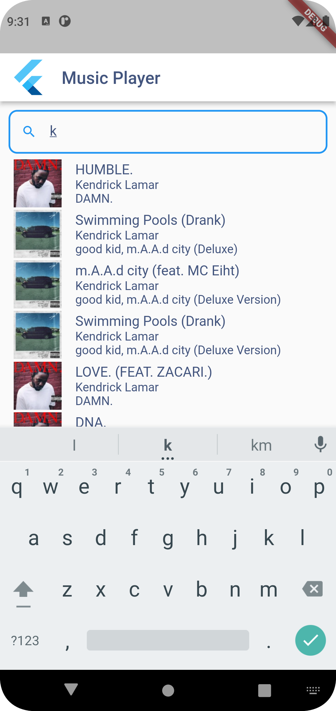

# Flutter Music Player

A Flutter App to Search and Play Music from [iTunes affiliate API](https://affiliate.itunes.apple.com/resources/documentation/itunes-store-web-service-search-api)

 

## Supported features
- Search song preview by the artist
- Play selected song, with option to pause, choose play next or choose play previous song
- Music control (Play, pause, next song, and previous song)
- Play song in the background / while search for another song
- This app is built using BLoC design pattern, to control the app state management.

## Supported devices
- You can run this app on Android API level 21 (Android 5.0 / Lollipop) or above.

## Requirement to Build the App
- Clone respository
```bash
git clone https://github.com/rizro/flutter_music_player.git
```
- Open repository
```bash
cd flutter_music_player
```
- Run command
```bash
flutter pub get
flutter run
```

## Deploy the app
- Follow the instruction to build the app above.
- To generate the APK for deployment use command below (the command already for obfuscating the APK)
```bash
flutter build apk --obfuscate --split-debug-info=obfuscate/symbols
```
- Follow instruction on the Google Play Console
- For more detailed steps, please follow the instruction [here](https://docs.flutter.dev/deployment/android)
